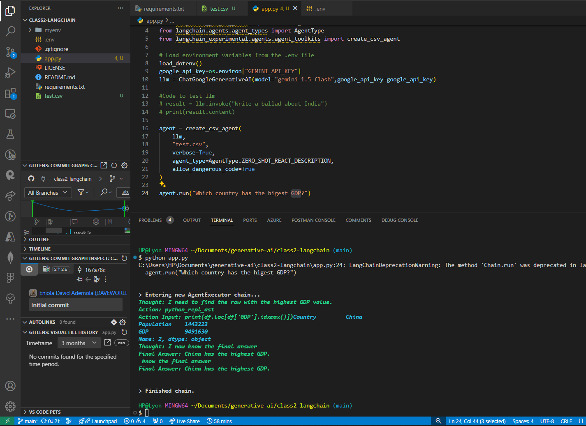

# LangChain LLM Project

This is a simple project demonstrating how to use **LangChain** with **Google Generative AI (Gemini 1.5)** to create an agent capable of querying a CSV file for data analysis.

## Features

- Integration with Google Generative AI using the `langchain_google_genai` package.
- Creation of a CSV agent to analyze data in a CSV file.
- Example query to find information from a dataset.

## Prerequisites

Ensure you have the following installed:

- Python 3.x
- [LangChain](https://github.com/hwchase17/langchain)
- [Google Generative AI SDK](https://developers.generativeai.google/)
- [python-dotenv](https://pypi.org/project/python-dotenv/)
- [langchain_google_genai](https://pypi.org/project/langchain-google-genai/)

## Installation

1. Clone the repository:

   ```bash
   git clone https://github.com/EniolaAdemola/class2-langchain
   ```

2. Navigate to the project directory:

   ```bash
   cd class2-langchain
   ```

3. Install the required dependencies:

   ```bash
   pip install -r requirements.txt
   ```

## Setup

1. Create a `.env` file in the root directory of the project to store your Google API key:

   ```bash
   touch .env
   ```

2. Add your Google Generative AI API key to the `.env` file:

   ```bash
   GEMINI_API_KEY=your_google_api_key_here
   ```

   Be sure to replace `your_google_api_key_here` with your actual API key.

3. Ensure you have a CSV file named `test.csv` with the relevant data in the root directory.

## Usage

To run the project, execute the following command:

```bash
python app.py
```

This command runs the script and queries the CSV file using the LangChain agent. For example, you can ask:

> "Which country has the highest GDP?"

## Example Output

Here's an example output from the query regarding the country with the highest GDP:



Let me know if there's anything else!

<!-- CONTACT -->

## Contact

Eniola Ademola - [@message me](https://instagram.com/_daveworld) - it.eniolaademola@gmail.com

Check out the project on GitHub: [LangChain LLM Project](https://github.com/EniolaAdemola/class2-langchain)
